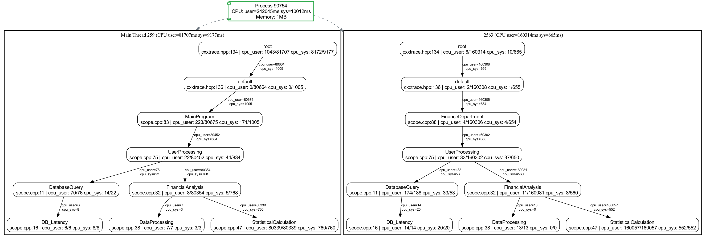

# CXXTrace - C++性能追踪分析库 (WIP)

**没写完，先放着，有空再写。**

**这是AI生成的README.md，没确认过是否正确。**

[](https://opensource.org/licenses/MIT)
[](https://cxxtrace.readthedocs.io)
[](https://github.com/10-neon/cxxtrace/actions)

CXXTrace 是一个轻量级的侵入式C++性能分析工具库，提供作用域级别和对象级别的性能指标（user time、sys time、 memory）采集能力。



## ✨ 核心特性

- **作用域级别开销统计** - 通过`TRACE_SCOPE`将性能开销拆分到作用域级别
- **对象级别开销统计** - 通过`TracePtr`将性能拆分开销到对象级别
- **低开销** - 相比常规的采样profile来说性能开销很低。
- **跨平台** - 支持Android、iOS、Linux、MacOS、Windows平台(**计划支持，目前只支持MacOS**)。
- 
## 📦 安装

```bash
git clone https://github.com/10-neon/cxxtrace.git
cd cxxtrace
pip install -r requirements.txt

# 编译安装
cmake -B build -S . -G Ninja -DCMAKE_BUILD_TYPE=Release
# 运行示例
cmake --build build --target scope && build/example/scope
# 安装
cmake --build build --target install
```
## 🚀 快速开始
```cpp
#include <cxxtrace/cxxtrace.hpp>

class SomeClass {
public:
    void do_something() {
        
    }
    void do_another() {
        
    }
}
void process_data() {
    TRACE_SCOPE(DataProcessing); // 追踪作用域开销
    
    // 你的业务逻辑...
    std::vector<int> buffer;
    {
        TRACE_SCOPE(MemoryAllocation); // 嵌套作用域
        buffer.resize(1'000'000);
    }
}

int main() {
    // 追踪指定对象
    auto sptr = cxxtrace::traceWrap(std::make_shared<SomeClass>()); // 追踪指定对象的性能开销
    sptr->do_something(); // 追踪对象方法调用开销

    auto uptr = cxxtrace::traceWrap(std::make_unique<SomeClass>()); // 追踪指定对象的性能开销
    uptr->do_something(); // 追踪对象方法调用开销

    auto ptr = cxxtrace::traceWrap(new SomeClass); // 追踪指定对象的性能开销
    ptr->do_something(); // 追踪对象方法调用开销
    ptr->do_another(); // 追踪对象方法调用开销
    delete ptr;
    ptr = nullptr;

    
    process_data();
    
    // 生成性能报告
    std::ofstream report("profile.json");
    report << cxxtrace::TraceDumper::dumpJson().dump(4);
}
 ```

运行后生成JSON性能报告，使用可视化工具分析：


```bash
# 安装可视化工具
cd tool/scopebox
cargo install --path .
cd -
 ```
```bash
scopebox convert --help

Usage: scopebox convert [OPTIONS]

Options:
  -i, --input <INPUT>      [default: trace.json]
  -o, --output <OUTPUT>    [default: output.dot]
  -f, --format <FORMAT>    [default: dot]
      --metrics <METRICS>  [default: cpu_user,cpu_sys]
  -h, --help               Print help
```

```bash
scopebox convert -i scope.json -o scope.dot
dot -Tpng scope.dot -o scope.png
```


## 📚 文档
访问 [在线文档](https://cxxtrace.readthedocs.io/zh-cn/latest/) 或本地构建：

```bash
# 本地构建文档
cd build
cmake --build . --target sphinx-doc

# 打开文档
open doc/sphinx/index.html
 ```

## 🛠️ 开发
运行测试套件：

```bash
cd build && ctest --output-on-failure
 ```

代码格式检查：

```bash
cmake --build . --target clang-format
 ```

## 🤝 贡献指南
欢迎提交Issue和PR

## 许可证
MIT License
