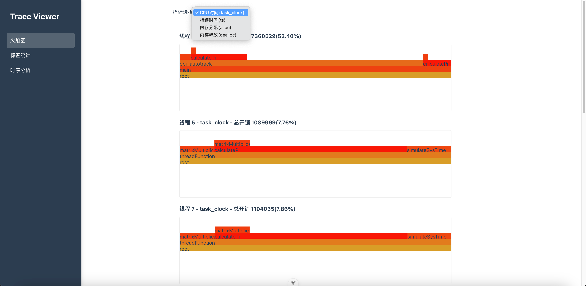
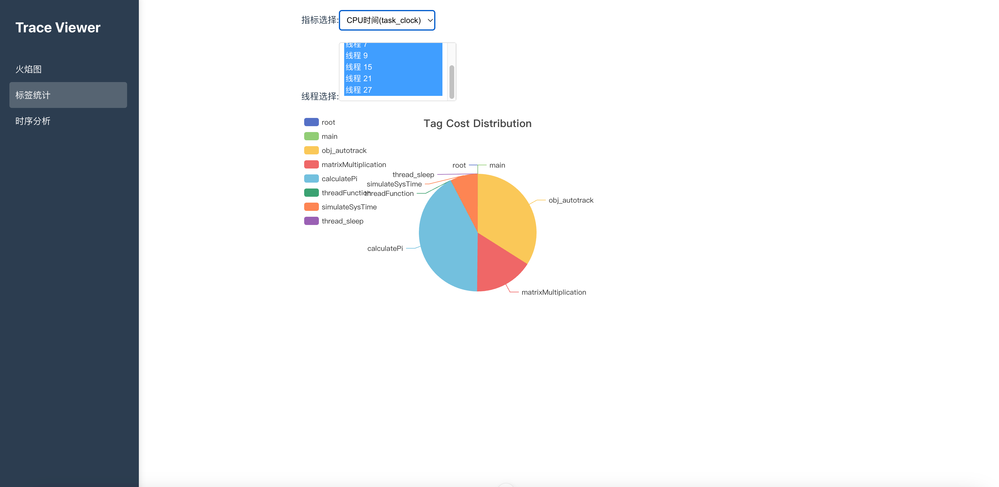

# CXXTrace - 侵入式、轻量级C++性能开销追踪

## 特性

| 功能 | 状态 | 描述 |
|------|------|------|
| 侵入式 | ✅ | 可以将业务信息和性能开销关联 |
| 轻量级 | ✅ | 线上可以启用，远低于正常profile开销 |
| 可视化 | ✅ | 提供一个html文件作为可视化UI，无任何其他依赖和操作 |
| 易于集成 | ✅ | 静态链接此库即可生效。在部分无法LD_PRELOAD的场景会很好用 |
| 内存和CPU指标 | ✅ | 支持task-clock、alloc-bytes、dealloc-bytes、duration |
| 多平台支持 | ✅ | Linux、Android、MacOS、iOS、(Windows计划支持) |
| 追踪形式 | ✅ | 提供对象和作用域两种追踪形式 |

## TODO
- [ ] 统计没有静态链接此库但是也被使用的动态库中相关内存分配
- [ ] 优化trace格式: 1. 改用flatbuffer 2. 使用一些类似 [neonlog](https://github.com/PlatformLab/NanoLog) 的优化手段
- [ ] 手写落盘过程: 计划参考java fqueue、批量写入、双缓冲等
- [ ] 优化现有代码
- [ ] 补充cmake安装，支持cpm安装
- [ ] 补充单测
- [ ] 补充文档

## 当前状态

⚠️ **开发状态**

- 项目为五一假期抽空开发，实现较为草率
- 核心功能已完成但实现较粗糙

✅ **已支持平台**
- Linux
- Android
- MacOS
- iOS

⚠️ **限制说明**
- Linux/Android内存指标仅统计静态链接本库的二进制内开销
- Windows平台大部分功能尚未支持

## 使用示例
```C++
#include <cxxtrace/cxxtrace.h>

using namespace neon;

// 高开销函数
double calculatePi();

class TestClass {
public:
    void doSomething(int n) {
        for (int i = 0; i < n; ++i) {
            calculatePi();
        }
    }
    void doAnotherThing() {
        calculatePi();
    }
};

void threadFunction(int thread_id) {
    TRACE_SCOPE(custom_tag_name); // 作用域开销追踪

    double pi = calculatePi();
    std::cerr << "PI = " << pi << '\n';

    {
        TRACE_SCOPE(nest_scope); // 嵌套作用域开销追踪
        std::this_thread::sleep_for(std::chrono::seconds(1));
        calculatePi()

    }
}


int main() {
    TraceEnable(); // 开启性能开销追踪
    TRACE_SCOPE(main); // 统计main scope开销

    // 支持unique_ptr、shared_ptr、裸指针的对象级别开销调用。
    auto tracked_test_obj = neon::traceWrap("obj_autotrack", neon::SourceLocation::current(), std::make_unique<TestClass>()); // 追踪某个C++对象性能开销
    tracked_test_obj->doSomething(2); // 这个对象上的调用的开销将自动被追踪。

    std::vector<std::thread> threads;

    // 创建多个线程
    for (int i = 0; i < 6; ++i) {
        std::cerr << "main thread start thread" << i << '\n';
        threads.emplace_back(threadFunction, i);
        tracked_test_obj->doAnotherThing(); // 这个对象上的调用的开销将自动被追踪。
    }
    // 可以和原始unique_ptr、shared_ptr、裸指针兼容，但是转换后将失去开销追踪能力
    std::unique_ptr<TestClass> untrack_test_obj = std::move(tracked_test_obj);

    // 等待所有线程完成
    for (auto& thread : threads) {
        thread.join();
    }
    return 0;
}

```

## 快速开始

### 选择平台/preset
首先选择你想尝试的平台
- macos
- ios
- linux
- linux-clang
- linux-gcc
- android
- android-arm
- android-arm64
- android-x86
- android-x86_64
- windows
- windows-arm
- windows-arm64
- windows-x86
- windows-x86_64

```bash
# 例如
platform=macos
```
### 编译
```bash
# configure
cmake --preset ${platform}
# build
cmake --build --preset ${platform}
# test，暂无测试用例
# ctest --preset ${platform}
# install，还未实现安装
# cmake --install --preset ${platform}

# 运行demo应用

```
### 运行 example 程序
```bash
build/${platform}/bin/Debug/cxxtrace_example
```
执行完后预期会在执行目录得到`cxxtrace.json`文件

### 构建webui

```bash
cd cxxtrace_viewer
pnpm install
pnpm run build
open dist/index.html
```

### 使用webui查看trace
#### 选择trace文件

#### 各线程火焰图


#### 各线程tag聚类信息

